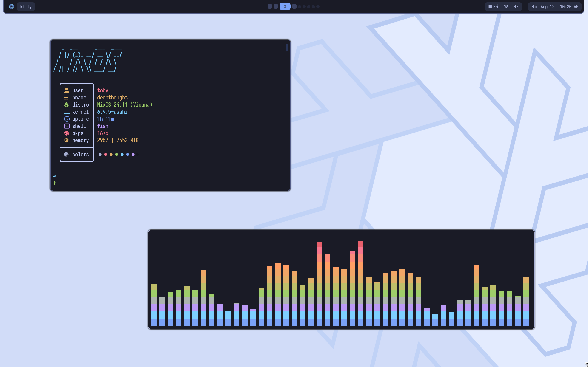
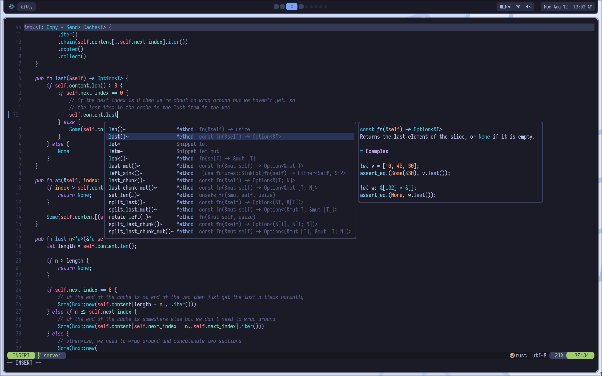

My Nix dotfiles (currently just [NixOS on Apple Silicon](https://nixos.wiki/wiki/NixOS_on_ARM/Apple_Silicon_Macs)). Very much a work in progress, and it will probably stay that way for a long time.

🚧 Nix-darwin config coming soon. 🚧

    
Screenshots from NixOS (slightly outdated)

    
    
    <table>
        <tr>
            <td>WM</td>
            <td><a href="https://hyprland.org">Hyprland</a></td>
        </tr>
        <tr>
            <td>Terminal</td>
            <td><a href="https://sw.kovidgoyal.net/kitty">Kitty</a></td>
        </tr>
        <tr>
            <td>Shell</td>
            <td><a href="https://fishshell.com/docs/current">Fish</a></td>
        </tr>
        <tr>
            <td>Editor</td>
            <td><a href="https://neovim.io">Neovim</a></td>
        </tr>
        <tr>
            <td>Resource fetcher</td>
            <td><a href="https://github.com/ssleert/nitch">Nitch</a></td>
        </tr>
        <tr>
            <td>Audio Visualiser</td>
            <td><a href="https://github.com/karlstav/cava">Cava</a></td>
        </tr>
    </table>

