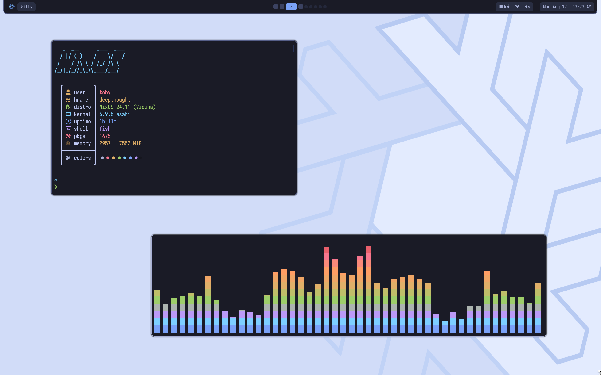
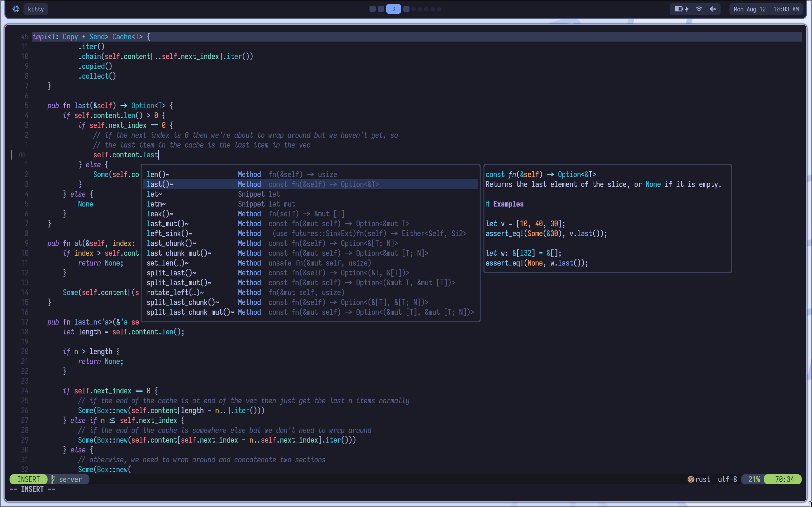

My Nix dotfiles (currently just [NixOS on Apple Silicon](https://nixos.wiki/wiki/NixOS_on_ARM/Apple_Silicon_Macs)). Very much a work in progress, and it will probably stay that way for a long time.

    
Screenshots

    
    

| | |
| - | - |
| WM               | [Hyprland](https://hyprland.org) |
| Terminal         | [Kitty](https://sw.kovidgoyal.net/kitty) |
| Shell            | [Fish](https://fishshell.com/docs/current) |
| Editor           | [Neovim](https://neovim.io) |
| Resource fetcher | [Nitch](https://github.com/ssleert/nitch) |
| Audio Visualiser | [Cava](https://github.com/karlstav/cava) |
